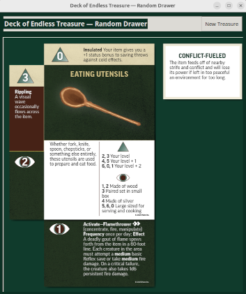

# PF Endless Treasure (CUP)

*A lightweight, local Python app that simulates treasure draws using the **JPGs you already own** for Paizo’s* Pathfinder Endless Treasure *card deck.*
No DRM workarounds. No bundled Paizo content. Just fast, reproducible treasure results for your table.



---

## What this is

* **Imports your purchased images**: Point the app at a folder of *Endless Treasure* JPGs that **you own** (not included here).
* **Generates treasure on demand**: Shuffle, draw, and reveal cards to build “endless” loot lists for encounters, downtime, or prep.
* **Offline & private**: Everything runs locally; your images stay on your machine.
* **Free & open source**: MIT‑licensed code. Community‑driven improvements welcome.

> **This project does not redistribute Paizo materials.** You must supply your own legally purchased JPGs from the *Endless Treasure* product.

---

## Quick start

1. **Install Python** (3.10+ recommended).
2. **Clone** this repository.
3. **Provide your images**: place your purchased *Endless Treasure* JPGs into a folder, e.g. `./cards/`.
4. **Install deps**: `pip install -r requirements.txt`
5. **Run** one of these:

   ```bash
   # Easiest (Linux/macOS): auto-venv + run
   ./run.sh               # uses ./cards if present
   ./run.sh --cards ./cards

   # Windows (Command Prompt):
   run.bat                # uses .\cards if present
   run.bat --cards .\cards

   # Direct (no helper script):
   python endless_treasure.py --cards ./cards
   python endless_treasure.py            # shows a folder picker if needed
   ```

   - Help: `python endless_treasure.py --help` or `python endless_treasure.py -?`

---

## Features

* **Two tabs: Random + Browser**
  - Random: Compose a polished treasure layout from 4 backs + 1 front with soft shadows on felt.
  - Browser: View single cards with the same styling; navigate by section or continuously through all cards.

* **Random draws**
  - Generates a random treasure on startup (when enough images are available).
  - Click “New Treasure” (or press Space/N/Enter) for new draws.

* **Item browsing with Item # jump**
  - In the Browser tab, use the “Item #” field to jump to an item directly.
  - Mapping: Item 1 → card 21 front (or back if front missing), Item 2 → 23, … Item 100 → 219.
  - The Item # field updates as you browse (blank when viewing non‑item cards 1–20).

* **Navigation**
  - Sections: Instructions (1–12), Damage (13–14), DC (15–16), Misc (17–20), Items (21–220).
  - Prev/Next traverse within a section and automatically continue across sections; wraps from last to first and vice versa.
  - Flip toggles between front/back of the current card when both are present.

* **Keyboard shortcuts**
  - Random tab: Space / N / Enter → New Treasure.
  - Browser tab: Left/Right → Prev/Next, Home/End → First/Last in section, Ctrl+L → focus Item #.
  - Enter (and keypad Enter) in Item # → jump to that item.

* **Flexible image location**
  - CLI: `--cards /path/to/JPGs` to set the folder.
  - If not provided or not found, the app shows an in‑app message with a prominent "Select Folder" button to open the picker.


---

## Why use this?

* You already own the *Endless Treasure* deck but want **quick** random treasure without shuffling physical cards.
* You prep offline or on a device where a simple local tool fits better than a web tool.

---

## How it works (high level)

* The app **indexes JPG filenames** in your `--cards` folder.
* It **does not** read or distribute Paizo text/art beyond the file paths you provide.

Notes on indexing behavior:
- Random tab uses cards numbered 21–220 (odd = fronts, even = backs).
- Browser tab indexes 1–220 for section navigation. If a first card has no trailing number but a matching “2” (e.g., `…Cards2.jpg`) exists, the matching unnumbered file (e.g., `…Cards.jpg`) is treated as card 1.

---

## Project status

* **License**: MIT (for the code).
* **Content**: No Paizo content is included in this repository. You provide your own legally purchased images.

---

## Packaging (optional)

If you want a standalone executable (no Python required on the target machine), you can build one with PyInstaller:

```bash
pip install pyinstaller
pyinstaller --name PF-Endless-Treasure --onefile --windowed endless_treasure.py
```

The built binary will be in `dist/`. On Windows, `--windowed` prevents a console window from appearing.

---

## Community Use Policy (CUP) & legal notes

This is a **non‑commercial fan project** that relies on Paizo’s **Community Use Policy** (CUP). All *Pathfinder*, *Endless Treasure*, and related marks are **owned by Paizo Inc.** and are referenced here **descriptively**. This project is **unofficial** and **not endorsed** by Paizo.

* **No redistribution**: This repo does **not** include Paizo art, text, or other IP. You must use your **own, lawfully obtained** JPGs.
* **No paywalls**: All CUP‑covered content here is **free and ungated**.
* **Required attribution**: Include Paizo’s CUP attribution block in this README (below).
* **Trademarks**: Use Paizo’s marks only as allowed by CUP; do not imply sponsorship.

 ```
 **PF Endless Treasure** uses trademarks and/or copyrights owned by Paizo Inc., used under Paizo's Community Use Policy
(paizo.com/licenses/communityuse). We are expressly prohibited from charging you to use or access this content. **PF Endless Treasure**
 is not published, endorsed, or specifically approved by Paizo. For more information about Paizo Inc. and Paizo products, visit paizo.com.
```

---

## Acknowledgments

Thanks to Paizo and the Pathfinder community. *Pathfinder*, *Deck of Endless Treasure*, and all related marks © Paizo Inc. Used in accordance with the Community Use Policy.

---

## Support

This project is free and will remain free under CUP. No support is offered by its creator.

---

## Tips

If you want to tip me for my work on this **PF Endless Treasure** software and encourage me to make more similar software, drop me a tip at: https://www.patreon.com/c/backroomsdotnet/membership

Need custom software or web work? Hire Valley Websites: https://valleywebsites.net/

Some of my sites include ...

Backrooms Wiki: https://backrooms.com/

Backrooms Novel Game: https://backrooms.net/

T. Gene Davis (Author): https://tgenedavis.com/"

The original OSR RPG: https://becmi.net/

Japanese Chess (Shogi) game: https://japanesechess.org/

Solo RPG: https://solorpg.net/

Speculative Blog: https://freesciencefiction.com/
